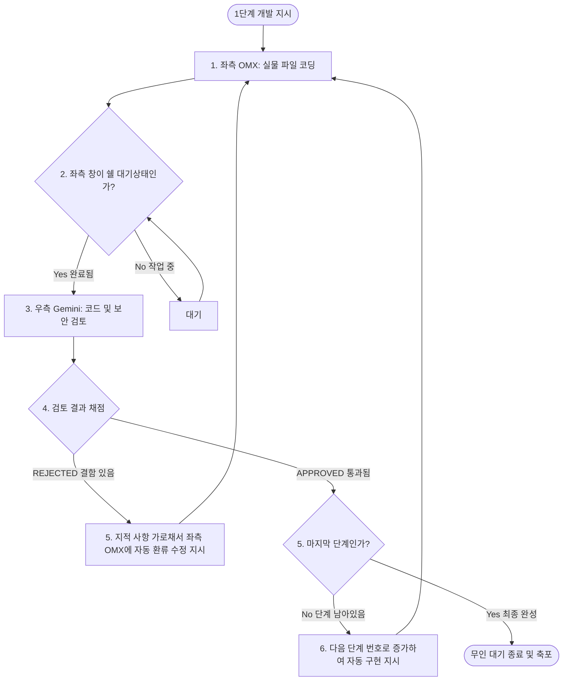

# 🤖 Dual-Agent tmux Collaboration Project (OMX & Gemini)

이 프로젝트는 **tmux** 환경 내에서 코드를 구현하는 **OMX(Codex)** 에이전트와 코드 품질을 감시하는 **Gemini(또는 agy)** 에이전트를 유기적으로 협업시켜, 기획부터 개발, 무인 코드 리뷰 및 자동 버그 수정까지의 전체 개발 라이프사이클을 극대화하는 **차세대 자동화 개발 템플릿**입니다.

---

## ⚡ 1. 아키텍처 및 역할 분담 (좌우 Pane 분리)

이 환경은 좌우 분할 창(Pane)을 통해 두 에이전트에게 비대칭적인 권한과 역할을 부여합니다.

*   **좌측 Pane (OMX / Codex)**: **"실물 기능 구현관 (손)"**
    *   **권한**: 읽기/쓰기/파일 수정/터미널 명령 실행 권한 활성화.
    *   **역할**: 설계에 맞춘 실제 소스 코드 작성, 모듈 및 패키지 설치.
*   **우측 Pane (Gemini / agy)**: **"수석 코드 검토관 (머리)"**
    *   **권한**: 오직 **읽기 전용(Read-only)**. 파일 수정 및 쓰기 권한 강력 차단 (샌드박스 격리).
    *   **역할**: 코드 스타일 및 성능 리뷰, 보안 취약점 정밀 진단, 기획서 설계도 작성.

---

## 🎬 2. [1부] 수동 기획실 (인간 감독관의 설계도 빌드업)

프로젝트를 시작할 때, 우측 창에 항상 대기 중인 Gemini(또는 agy)에게 에이전트 접두사(`$`)를 던져 다양한 직업의 전문 기획자로 빙의시켜 설계도를 뽑아냅니다.

> [!NOTE]
> 우측 창에 직접 입력할 때 `$접두사`를 명시하거나, 원격 조종기 스크립트를 통해 아래 명령어로 쏘아 보낼 수 있습니다.

### Step 1. 기획서 도출 (PM 소환)
```bash
./scripts/ask-gemini.sh "$product-manager 나는 '멋진 자전거 쇼핑몰 웹 서비스'를 만들고 싶어. 주요 판매 품목, 상품 상세 보기, 장바구니 담기가 포함된 요구사항 기획서(PRD)를 작성해줘."
```

### Step 2. 아키텍처 설계 (설계자 소환)
```bash
./scripts/ask-gemini.sh "$architect 방금 기획서를 기준으로 기술 스택(Express + HTML/CSS)을 추천해주고, 최적의 폴더 트리와 파일 목록을 설계해줘."
```

### Step 3. 일정표 쪼개기 (일정 플래너 소환)
```bash
./scripts/ask-gemini.sh "$planner 설계된 구조를 바탕으로, 좌측 OMX 개발자가 1단계부터 에러 없이 개발할 수 있도록 쪼개진 [구현 ToDo 리스트 및 순서 가이드]를 짜줘."
```

---

## 🚀 3. [2부] 무인 자동 개발소 (AI들의 무한 피드백 탁구 개발)

설계 도면과 ToDo 리스트가 나왔다면, 이제 키보드에서 손을 떼고 팔짱을 낀 채 AI들이 지들끼리 연타로 소통하며 완제품을 만드는 과정을 구경하시면 됩니다.



### ⚙️ 무인 릴레이 파이프라인 가동법

1.  **에이전트 런타임 켜두기**:
    *   좌측 OMX 창과 우측 Gemini(또는 agy) 창은 일할 준비를 마친 대기 상태로 **그대로 켜둡니다.** (종료하지 마세요!)
2.  **새로운 터미널 창(또는 탭) 열기**:
    *   프로젝트 폴더로 이동합니다. (`cd ~/omxtest`)
3.  **무인 릴레이 파이프라인 기동 (총 5단계 일정인 경우)**:
    *   새 터미널에 아래 명령어를 실행하면, 스크립트가 무선 조종사가 되어 듀얼 창에 신호를 쏘며 무인 릴레이 코딩이 시작됩니다!
    ```bash
    ./scripts/relay-developer.sh 5
    ```

---

## 💾 4. 다른 기기로 환경 복제하기 (GitHub Clone & Play)

### [처음 세팅할 때] - 내 깃허브에 올리기
```bash
git init
git add .
git commit -m "feat: 듀얼 에이전트 및 무인 릴레이 파이프라인 구축"
git remote add origin [내_깃허브_저장소_주소]
git push -u origin main
```

### [이사 갈 때] - 새 컴퓨터에서 즉시 부활시키기
새 기기나 우분투 환경에서 아래 순서대로 3단계만 진행하면 모든 환경이 100% 완벽 복제됩니다.

1.  **새 기기에 `omx` 공식 설치 및 설정**:
    ```bash
    omx setup
    omx login
    ```
2.  **프로젝트 깃 클론**:
    ```bash
    git clone [내_깃허브_저장소_주소] my-project
    cd my-project
    ```
3.  **로컬 셋업 초기화 및 실행 권한 부여**:
    ```bash
    # 꼬인 훅과 캐시를 강제로 밀고 재생성 (프로젝트 2번 선택)
    omx setup --force
    
    # 쉘 스크립트 권한 부여 및 기동
    chmod +x scripts/*.sh
    ./scripts/start-ai.sh gemini
    ```

---

## ⚠️ 5. 트러블슈팅 (Troubleshooting)

### Q. `BeforeAgent` 훅 에러나 `Module not found` 에러가 발생해요!
*   **원인**: 이전 기기 설정이나 다른 런타임 캐시가 꼬여서 존재하지 않는 경로(`.gemini/hooks/`)를 참조하고 있을 때 나타나는 전형적인 오류입니다.
*   **해결책**:
    1.  기존 꼬인 메모리를 물고 있는 tmux 세션을 강제로 끕니다:
        ```bash
        tmux kill-session -t ai
        ```
    2.  로컬 프로젝트 범위로 셋업을 깨끗하게 초기화합니다 (3번 reset ➔ 2번 project 선택):
        ```bash
        omx setup --force
        ```
    3.  다시 세션을 켜고 기동해 보세요:
        ```bash
        ./scripts/start-ai.sh gemini
        ```
